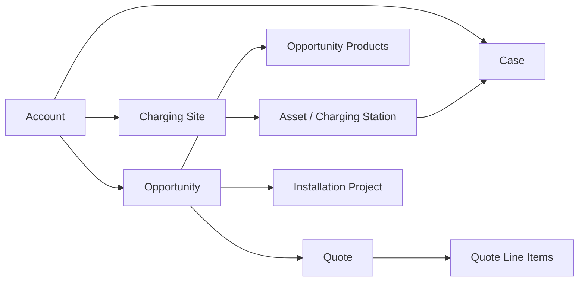

# VoltEdge 360

**Enterprise-style Salesforce implementation for an EV charging infrastructure company.**

VoltEdge 360 is a portfolio and reference implementation designed to demonstrate how Salesforce can support the full commercial and operational lifecycle of an EV charging business — from Sales Cloud and Salesforce CPQ through approval governance, implementation delivery, external provisioning, asset management, and customer support.

The project is built using source-driven Salesforce development practices with Git, Salesforce DX, scratch orgs, automated Apex testing, and GitHub Actions CI.

---

## Project Status

| Area | Status |
| --- | --- |
| Core CRM & EV charging data model | Implemented |
| Sales Cloud | Implemented |
| Service Cloud | Implemented |
| Salesforce CPQ | Implemented |
| CPQ Bundles & Product Rules | Implemented |
| CPQ Pricing, Summary Variables & Discount Schedules | Implemented |
| CPQ Pricing Waterfall & Account-Based Pricing | Implemented |
| CPQ Quote Generation | Implemented |
| Quote-to-Cash foundation | Implemented |
| Discount governance & approval lifecycle | Implemented |
| Revenue calculations | Implemented |
| Delivery / installation tracking | Implemented |
| External charger provisioning integration | Implemented |
| Security personas | Implemented |
| Reports & dashboards | Implemented |
| Fresh scratch-org deployment | Implemented |
| GitHub Actions CI | Implemented |
| Revenue Cloud | Roadmap |
| Data Cloud | Roadmap |
| Marketing automation | Roadmap |
| AI / Agentforce | Roadmap |

---

## Business Scenario

VoltEdge is a fictional EV charging infrastructure provider.

Its Salesforce implementation needs to support several connected business processes:

- manage B2B customers and their charging locations
- track deployed charging stations as Assets
- manage EV infrastructure sales opportunities
- configure commercial charging packages using Salesforce CPQ
- enforce valid product combinations through Product Rules
- apply quantity-based and account-based pricing
- calculate recurring and one-time revenue
- prepare customer Quotes and generated proposals
- control commercial discounts
- route high-discount Quotes for approval
- prevent approved commercial terms from being changed silently
- convert won deals into installation projects
- provision installation projects into an external charger platform
- support deployed charging infrastructure through Service Cloud
- provide reporting for sales and delivery teams

The goal of the project is not to create a minimal demo org, but to model the kinds of governance, automation, security, integration, testing, and deployment concerns found in a real Salesforce implementation.

---

# Architecture

## Core Domain Model



### Main business entities

**Account**

Represents a VoltEdge customer.

**Charging Site**

Represents a physical customer location where EV charging infrastructure is deployed.

Relationship:

```text
Account
  └── Charging Site
        └── Asset / Charging Station
```

**Asset**

Represents an installed charging station.

Assets are linked both to the customer Account and the correct Charging Site.

**Opportunity**

Represents the commercial sales process.

**Opportunity Product**

Represents products sold as part of the deal and drives revenue calculations.

**Quote / Quote Line Item**

Represents customer-facing commercial terms and the governed discount approval process.

**Installation Project**

Created from a Closed Won Opportunity and represents delivery of the sold infrastructure.

**Case**

Represents post-sale customer support and is routed through Service Cloud queues and Omni-Channel.

---

# Sales Cloud

VoltEdge uses a dedicated sales process for EV charging infrastructure.

## EV Charging Opportunity

Custom Opportunity fields include:

- Deal Type
- Number of Sites
- Number of Chargers
- Solution Type
- Target Go-Live Date
- Requires Site Survey
- Loss Reason

A dedicated Opportunity record type and business process are used for EV charging deals.

Business validation ensures that important commercial information is present at the appropriate stages of the sales process.

Closed Lost opportunities require a loss reason.

---

# Product & Revenue Model

VoltEdge uses Salesforce Products and Price Books as the commercial catalog.

The implementation supports multiple revenue models, including:

- one-time hardware revenue
- monthly recurring revenue
- annual recurring revenue

Opportunity-level revenue metrics include:

| Metric | Purpose |
| --- | --- |
| One-Time Revenue | Non-recurring hardware / implementation revenue |
| MRR | Monthly Recurring Revenue |
| ARR | Annual Recurring Revenue |
| Recurring TCV | Total recurring contract value |
| Total Contract Value | Combined commercial value |

Revenue totals are recalculated automatically from Opportunity Products.

The rollup service supports:

- insert
- update
- delete
- undelete
- multiple Opportunities in the same transaction
- multiple currencies

---

# Multi-Currency

The project is designed for multi-currency operation.

Current reference currencies:

```text
PLN
EUR
USD
```

The CI environment creates PLN and EUR as technical test currencies.

The conversion rates used during automated CI validation are deliberately neutral technical fixtures and are **not intended to represent real production FX rates**.

---

# Salesforce CPQ

VoltEdge includes a practical Salesforce CPQ implementation for configurable EV charging solutions.

The main bundle is:

```text
VoltEdge Commercial Charging Package
```

It combines charging hardware, installation, software, and support into a governed commercial configuration.

Implemented CPQ capabilities include:

- configurable bundles and Product Options
- Product Rules for technical and commercial compatibility
- 150 kW charger dependency on Premium Installation
- Enterprise / 24x7 Support dependency on Premium Software
- Summary Variables for quote-level aggregation
- `VE Charger Volume Discount` Discount Schedule
- Price Rules
- account-driven strategic pricing
- Price Books and multi-currency pricing
- pricing waterfall behavior
- quote generation using a customer-facing proposal template
- downstream discount governance and approval routing

The pricing flow combines multiple pricing mechanisms rather than relying on one manual discount field:

```text
Price Book / List Price
        ↓
Quantity-based Volume Pricing
        ↓
Account-based Strategic Pricing
        ↓
Additional / Manual Discount
        ↓
Final Net Price
```

This allows the CPQ implementation to demonstrate both configuration and pricing behavior: product compatibility, aggregate quantity logic, structured volume discounts, customer-specific pricing, and final commercial governance.

The implementation also includes practical troubleshooting experience. For example, the Summary Variable configuration required the correct CPQ-visible `Product Code` filter field, and account-driven pricing required correct handling of Salesforce field types in CPQ rule conditions and formulas.

Detailed architecture, implemented rules, pricing behavior, interview talking points, and demo scenarios are documented in [Salesforce CPQ Implementation Case Study](docs/salesforce-cpq.md).

---

# Quote-to-Cash Foundation

Quotes are connected to Opportunities and use Salesforce Products and Price Books.

The implementation adds enterprise-style governance around commercial terms rather than allowing unrestricted Quote Line editing.

Key capabilities include:

- automatic Quote expiration defaults
- discount reason requirements
- effective discount calculation
- maximum Quote discount rollup
- approval routing
- commercial revision tracking
- approval invalidation after commercial changes
- Quote Line locking during approval
- strict maximum discount enforcement

---

# Pricing Integrity

A central design goal is to prevent approval rules from being bypassed by manipulating both `UnitPrice` and `Discount`.

Each Quote Line stores an immutable commercial pricing baseline:

```text
Approval_Basis_Unit_Price__c
```

When the line is first created, the current Price Book Entry unit price is captured as the approval basis.

Effective discount is calculated against that frozen baseline rather than against the current Price Book Entry.

Conceptually:

```text
Effective Discount =
1 - Net Sales Price / Approval Basis Unit Price
```

where:

```text
Net Sales Price =
UnitPrice × (1 - Discount)
```

This means both of the following are treated as commercial discount:

```text
List Price: 1,000
Sales Price: 850
Discount field: 0%
```

and:

```text
List Price: 1,000
Sales Price: 1,000
Discount field: 15%
```

Both represent an effective 15% discount.

The approval basis is intentionally frozen so that later Price Book changes cannot silently alter the approval history of an existing Quote.

---

# Discount Governance

VoltEdge uses the following commercial policy:

| Effective Discount | Approval |
| ---: | --- |
| 0% – 10% | No approval |
| >10% – 20% | Sales Manager |
| >20% – 30% | Commercial Director |
| >30% | Blocked |

Exactly:

```text
30.000%
```

is allowed.

Anything above the maximum, including:

```text
30.001%
```

is rejected.

Any effective commercial discount also requires a Discount Reason.

---

# Approval Routing

Approval routing is hierarchy-based.

For a Quote owned by a Sales Rep:

```text
Sales Rep
   │
   ├── Manager
   │     └── approves >10% to 20%
   │
   └── Manager's Manager
         └── approves >20% to 30%
```

The approval process uses the real Salesforce approval engine.

The implementation verifies scenarios including:

- approval by Sales Manager
- approval by Commercial Director
- rejection
- recall
- resubmission
- missing manager
- inactive manager
- exact approval thresholds

A Quote cannot move into review when the required approver is unavailable.

---

# Commercial Revision Control

Approved Quotes must not silently change after approval.

VoltEdge therefore tracks:

```text
Commercial_Revision__c
```

Commercially meaningful Quote Line changes invalidate the current approval state.

Examples include changes to:

- Product
- approval pricing basis
- Quantity
- Unit Price
- Discount
- Discount Reason
- Service Date

When commercial terms change:

```text
Approved Quote
      │
      ▼
Commercial change detected
      │
      ▼
Approval invalidated
      │
      ▼
Quote returned to Draft
      │
      ▼
Commercial Revision incremented
      │
      ▼
New approval required
```

Non-commercial changes such as an internal Description update do not invalidate approval.

---

# Approval Locking

While a Quote is in the approval process, its Quote Lines are protected from modification.

The system blocks commercial writes when either approval indicator shows that the Quote is under review.

This protection covers:

- insert
- update
- delete
- undelete

This prevents users or integrations from changing the commercial basis while an approver is reviewing the Quote.

---

# Delivery Automation

When an eligible Opportunity reaches Closed Won, Salesforce creates an Installation Project.

The project carries important delivery context from the Opportunity, including:

- customer
- number of sites
- number of chargers
- solution type
- target go-live date

This creates a clear handoff between:

```text
Sales
  ↓
Closed Won
  ↓
Installation Project
  ↓
Operations / Delivery
```

---

# External Charger Provisioning Integration

Installation Projects can be submitted from Salesforce to an external charger provisioning platform directly from the record page.

The integration is intentionally asynchronous and separates UI orchestration from transport and retry logic:

```text
Operations User
      ↓
Send to Provisioning Quick Action
      ↓
VE Send to Provisioning Screen Flow
      ↓
VEChargerProvisioningAction
      ↓
VEChargerProvisioningQueueable
      ↓
VEChargerProvisioningService
      ↓
Named Credential
      ↓
POST /v1/installations
      ↓
External Charger Platform
```

Key capabilities include:

- asynchronous HTTP callouts using Queueable Apex
- Named Credential based endpoint management
- `Idempotency-Key` header based on the Salesforce Installation Project Id
- protection against re-provisioning a project that is already `Provisioned`
- persisted operational status and external provisioning id
- HTTP status, attempt count, last-attempt timestamp, and error details for supportability
- automatic retry for `429` and `5xx` responses
- maximum of three automatic attempts
- permanent failure for non-retryable responses such as `400`
- manual retry path after the automatic retry limit is exhausted
- Dynamic Action visibility that hides `Send to Provisioning` while the request is `Queued` and after it is `Provisioned`

Provisioning state is persisted on `Installation_Project__c` using fields such as:

```text
Provisioning_Status__c
External_Provisioning_Id__c
Provisioning_HTTP_Status__c
Provisioning_Attempt_Count__c
Provisioning_Last_Attempt__c
Provisioning_Error__c
```

A transient failure follows this lifecycle:

```text
Attempt 1
POST /v1/installations
HTTP 500
      ↓
Status remains Queued
Attempt Count = 1
      ↓
Automatic Queueable retry
      ↓
Attempt 2
POST /v1/installations
HTTP 201
      ↓
Provisioned
External Provisioning Id stored
Attempt Count = 2
```

The integration was also manually verified against a stateful mock endpoint with both successful retry (`500 → 201`) and retry exhaustion (`500 → 500 → 500 → Failed`) scenarios.

Detailed architecture, request/response contract, retry policy, test scenarios, and troubleshooting notes are documented in [Charger Provisioning Integration](docs/charger-provisioning-integration.md).

---

# Service Cloud

The implementation includes a Service Cloud foundation for supporting deployed EV charging infrastructure.

Capabilities include:

- Case management
- L1 Support queue
- Technical Support queue
- assignment rules
- Omni-Channel
- routing configurations
- presence configuration
- Case-to-Asset relationship
- customer and charging-station support context

Example flow:

```text
Customer Case
     │
     ▼
Assignment Rules
     │
     ▼
Support Queue
     │
     ▼
Omni-Channel
     │
     ▼
Available Service Agent
```

---

# Data Integrity

The implementation contains additional controls designed to protect the EV charging data model.

For example, a Charging Site cannot simply be reassigned to another customer Account when charging Assets are already associated with that location.

This prevents data such as:

```text
Customer A
   └── Site
         └── Chargers
```

from accidentally becoming:

```text
Customer B
   └── Site
         └── Chargers still belonging to Customer A
```

without an explicit migration process.

Asset configuration also uses lookup filtering to ensure that the selected Charging Site belongs to the same Account.

---

# Security Model

VoltEdge uses permission sets to represent business personas.

| Permission Set | Persona |
| --- | --- |
| `VE_Sales_User` | Sales users |
| `VE_Service_User` | Service agents |
| `VE_Operations_User` | Delivery / operations |
| `VE_Commercial_Approver` | Commercial approvers |
| `VE_Charger_Provisioning_User` | Users allowed to operate the charger provisioning feature |

The security model separates editable commercial data from calculated or system-controlled fields.

Examples of protected information include:

- effective discount
- approval pricing basis
- revenue calculations
- approval routing fields
- commercial revision
- system-generated delivery and provisioning information

The intent is to enforce business rules through both Salesforce security and application logic rather than relying only on UI configuration.

---

# Automation

VoltEdge uses a combination of declarative automation and Apex.

| Automation | Technology | Purpose |
| --- | --- | --- |
| Prevent Charging Site Account change | Flow | Protect Account / Site / Asset integrity |
| Installation Project creation | Flow | Sales-to-delivery handoff |
| Charger provisioning submission | Screen Flow + Invocable Apex + Queueable Apex | Submit Installation Projects to the external charger platform with retry and audit state |
| Quote expiration default | Flow | Default commercial validity period |
| Quote approval routing | Flow | Calculate approval requirement and approver |
| Quote Line commercial governance | Apex Trigger / Handler | Detect pricing and commercial changes |
| Quote discount rollup | Apex | Calculate maximum effective discount |
| Opportunity revenue rollup | Apex | Calculate revenue metrics |
| Discount approval | Salesforce Approval Process | Govern high-discount Quotes |
| Case routing | Service Cloud / Omni-Channel | Route support work |

---

# Apex Architecture

Commercial logic is separated into focused services rather than being implemented directly inside triggers.

Important components include:

```text
VEQuoteLineItemTrigger
        │
        ▼
VEQuoteLineItemHandler
        │
        ├── Pricing basis capture
        ├── Approval write protection
        ├── Commercial change detection
        │
        └── Rollup coordination
                │
                ▼
VEQuoteDiscountRollupService
```

Revenue calculations are handled independently by:

```text
VEOpportunityRevenueRollupService
```

The charger provisioning integration uses a separate application-service pipeline:

```text
VEChargerProvisioningAction
        │
        ▼
VEChargerProvisioningQueueable
        │
        ▼
VEChargerProvisioningService
        │
        ▼
External REST API
```

This keeps trigger responsibilities small, separates business concerns, and makes integration behavior directly testable.

---

# API 67 Data Access Hardening

The project explicitly distinguishes between:

- real user-context business operations
- internal system automation
- technical test fixtures

Internal automation that must enforce governance regardless of field-level security uses explicit system-mode data access where appropriate.

Lifecycle tests that represent real Sales users and approvers continue to execute under their business personas.

This keeps security testing meaningful while avoiding accidental dependency on administrator-level test execution.

---

# Testing Strategy

The Apex test suite covers both unit-level behavior and multi-step business lifecycle scenarios.

Current fresh-org baseline:

```text
Tests Ran:         36
Pass Rate:         100%
Fail Rate:         0%
Org Wide Coverage: 94%
```

The test suite includes scenarios for:

- revenue calculations
- multiple currencies
- bulk Opportunity Product processing
- Quote discount rollups
- effective pricing calculations
- exact 30% discount boundary
- discount reason enforcement
- immutable approval basis
- bulk Quote Line processing
- partial transaction success
- approval locking
- commercial revision invalidation
- approval submission
- manager approval
- commercial director approval
- rejection
- recall
- resubmission
- missing manager
- inactive manager
- successful charger provisioning
- request payload and idempotency header validation
- permanent client errors without retry
- transient server errors with retry scheduling
- retry exhaustion
- invalid success-response JSON
- missing external provisioning id
- already-provisioned idempotency behavior
- Invocable Apex submission behavior

Bulk-oriented tests include scenarios such as processing 200 Quote Lines across multiple Quotes.

---

# Continuous Integration

The repository contains a GitHub Actions workflow:

```text
.github/workflows/salesforce-ci.yml
```

Every pull request to `main` is validated against a fresh Salesforce scratch org.

The CI pipeline performs:

```text
Checkout repository
        ↓
Install Salesforce CLI
        ↓
Authenticate Dev Hub
        ↓
Create fresh scratch org
        ↓
Bootstrap Omni-Channel routing
        ↓
Bootstrap Case queues
        ↓
Deploy complete Salesforce source
        ↓
Configure CI currencies
        ↓
Run RunLocalTests
        ↓
Validate Apex coverage
        ↓
Upload test artifact
        ↓
Delete scratch org
```

The pipeline enforces:

```text
All Apex tests must pass
AND
Org-wide Apex coverage must be >= 90%
```

Scratch org deletion runs even when an earlier CI step fails.

This ensures that successful development does not depend on configuration that exists only in a developer's local Salesforce org.

---

# Fresh Scratch Org Deployment

## Prerequisites

Required tools:

```text
Git
Node.js
Salesforce CLI
A Salesforce Dev Hub
```

Authenticate a Dev Hub:

```bash
sf org login web \
  --alias voltedge-dev \
  --set-default-dev-hub
```

Create a scratch org:

```bash
sf org create scratch \
  --definition-file config/project-scratch-def.json \
  --alias voltedge-scratch \
  --duration-days 1 \
  --target-dev-hub voltedge-dev \
  --wait 20
```

The scratch definition enables the platform capabilities required by the project, including Quotes, multi-currency, Service Cloud, Omni-Channel, and Translation Workbench.

---

## Metadata Deployment Order

Service Cloud queue metadata has a deployment dependency on its routing configuration.

Deploy routing configuration first:

```bash
sf project deploy start \
  --source-dir force-app/main/default/queueRoutingConfigs \
  --target-org voltedge-scratch \
  --wait 15
```

Then deploy queues:

```bash
sf project deploy start \
  --source-dir force-app/main/default/queues \
  --target-org voltedge-scratch \
  --wait 15
```

Then deploy the full application:

```bash
sf project deploy start \
  --source-dir force-app \
  --target-org voltedge-scratch \
  --test-level NoTestRun \
  --wait 30
```

---

## Configure Development Currencies

Example technical setup:

```bash
sf data create record \
  --sobject CurrencyType \
  --values "IsoCode=EUR ConversionRate=1 DecimalPlaces=2 IsActive=true" \
  --target-org voltedge-scratch
```

```bash
sf data create record \
  --sobject CurrencyType \
  --values "IsoCode=PLN ConversionRate=1 DecimalPlaces=2 IsActive=true" \
  --target-org voltedge-scratch
```

These rates are development fixtures only.

---

## Run Apex Regression

```bash
sf apex run test \
  --target-org voltedge-scratch \
  --test-level RunLocalTests \
  --code-coverage \
  --result-format human \
  --wait 30
```

Expected baseline for the current validated implementation:

```text
36 tests
100% pass rate
94% org-wide Apex coverage
```

---

# Repository Structure

```text
voltedge-salesforce-360/
│
├── .github/
│   └── workflows/
│       └── salesforce-ci.yml
│
├── config/
│   └── project-scratch-def.json
│
├── docs/
│   ├── charger-provisioning-integration.md
│   └── salesforce-cpq.md
│
├── force-app/
│   └── main/
│       └── default/
│           ├── applications/
│           ├── approvalProcesses/
│           ├── assignmentRules/
│           ├── classes/
│           ├── dashboards/
│           ├── flexipages/
│           ├── flows/
│           ├── layouts/
│           ├── namedCredentials/
│           ├── objects/
│           ├── permissionsets/
│           ├── quickActions/
│           ├── queues/
│           ├── queueRoutingConfigs/
│           ├── reports/
│           └── triggers/
│
├── scripts/
├── README.md
└── sfdx-project.json
```

---

# Demo Scenarios

The implementation can be demonstrated through several end-to-end business scenarios.

## 1. CPQ Configuration and Pricing

Configure the `VoltEdge Commercial Charging Package` for a strategic customer using an eligible charger quantity.

Expected behavior:

```text
Bundle configuration
→ Product Rules enforce compatible options
→ Summary Variable aggregates eligible charger quantity
→ VE Charger Volume Discount applies the volume tier
→ Account-based Price Rule applies strategic pricing
→ additional / manual discount is applied if entered
→ final Net Price is calculated
→ commercial discount governance evaluates the result
```

This scenario demonstrates bundle configuration, Product Options, Product Rules, Summary Variables, Discount Schedules, Price Rules, account-driven pricing, and pricing waterfall behavior.

## 2. EV Infrastructure Sale

```text
Account
→ Opportunity
→ Products
→ Revenue metrics
→ Quote
```

Demonstrates Sales Cloud, Products, Price Books, multi-currency, and revenue calculations.

## 3. Standard Discount

Create a Quote Line with an effective discount of 8%.

Expected result:

```text
Approval Required: No
```

## 4. Sales Manager Approval

Create a Quote with an effective discount of 15%.

Expected result:

```text
Approval Required: Yes
Approval Level: Sales Manager
Approver: Opportunity Owner's Manager
```

## 5. Commercial Director Approval

Create a Quote with an effective discount of 25%.

Expected result:

```text
Approval Required: Yes
Approval Level: Commercial Director
```

## 6. Discount Guardrail

Attempt an effective discount above 30%.

Expected result:

```text
Save blocked
```

## 7. Commercial Change After Approval

Approve a Quote and then change its Unit Price.

Expected result:

```text
Approved
→ commercial change
→ Draft
→ revision increment
→ approval required again
```

## 8. Service Case

Create a Case for a deployed charging station.

Demonstrates:

```text
Case
→ Assignment Rules
→ Queue
→ Omni-Channel
→ Service Agent
```

## 9. Closed Won Delivery

Close an eligible Opportunity as Won.

Expected result:

```text
Installation Project created automatically
```

## 10. External Charger Provisioning with Retry

Submit a new Installation Project using `Send to Provisioning` and simulate a transient external API failure.

Expected result:

```text
User action
→ Flow submission
→ Queued
→ POST /v1/installations
→ HTTP 500
→ automatic Queueable retry
→ HTTP 201
→ Provisioned
→ External Provisioning Id stored
```

The same scenario can be run with three consecutive `5xx` responses to demonstrate retry exhaustion and a final `Failed` state with manual retry available.

---

# Design Decisions

## Explicit pricing baseline

Approval decisions are based on a frozen Quote Line pricing baseline instead of the current Price Book price.

This preserves the historical commercial context of the approval.

## Maximum effective discount

Approval routing uses the maximum effective discount across Quote Lines rather than only the visible Salesforce Discount field.

This prevents alternative price-entry techniques from bypassing commercial governance.

## Approval invalidation

A previously approved Quote is not considered permanently approved.

Commercially meaningful changes invalidate the decision and require review again.

## System automation vs user permissions

System-owned calculations execute with the access needed to maintain integrity.

Real business lifecycle tests continue to execute as Sales and approval personas.

## Asynchronous external provisioning

Provisioning is implemented through Queueable Apex rather than a synchronous screen transaction.

This prevents the user experience from depending directly on external API latency and provides a natural boundary for retries, audit state, and operational recovery.

## Idempotent external requests

The Salesforce Installation Project Id is sent as the `Idempotency-Key` so an external platform can safely recognize repeated submissions of the same business operation.

Salesforce additionally prevents a project with both `Provisioned` status and an external provisioning id from being submitted again.

## Portable scratch configuration

The project uses an explicit scratch-org definition instead of depending on the configuration of one source org.

This improves portability and CI reproducibility.

## Deployment dependency bootstrap

Queue routing configuration and queues are deployed before the complete source package because of their Salesforce metadata dependency.

This dependency is encoded directly in CI rather than being left as undocumented manual knowledge.

---

# Roadmap

Future iterations are intended to extend VoltEdge 360 into additional Salesforce platform capabilities.

Potential areas include:

```text
Revenue Cloud
Data Cloud
Marketing automation
Agentforce / AI
MuleSoft integrations
Customer self-service
Advanced installation scheduling
Telemetry / charging-station integrations
Predictive service
Advanced commercial analytics
```

Salesforce CPQ is already implemented in the current portfolio scope. Revenue Cloud is tracked separately as a future platform extension rather than being used as a label for the existing CPQ implementation.

---

# Engineering Principles

VoltEdge 360 is developed around several principles:

```text
Source-driven development
Business rules over demo shortcuts
Least-privilege security
Bulk-safe Apex
Explicit commercial governance
Asynchronous integration design
Idempotent external operations
Auditable retry and failure handling
Automated regression testing
Reproducible environments
CI validation on fresh orgs
Clear separation of responsibilities
Production-oriented design decisions
```

---

# Disclaimer

VoltEdge 360 is a portfolio and reference implementation.

VoltEdge is a fictional company and the repository contains no real customer or production data.

The project is intended to demonstrate Salesforce architecture, administration, Salesforce CPQ, automation, Apex development, integrations, security design, testing, source control, and CI/CD practices.