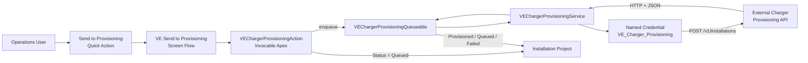
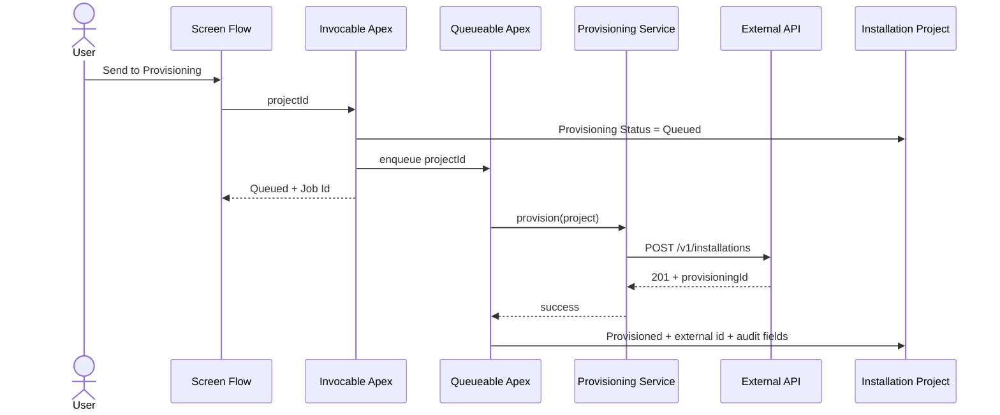
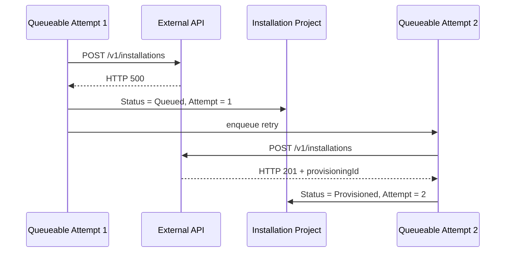
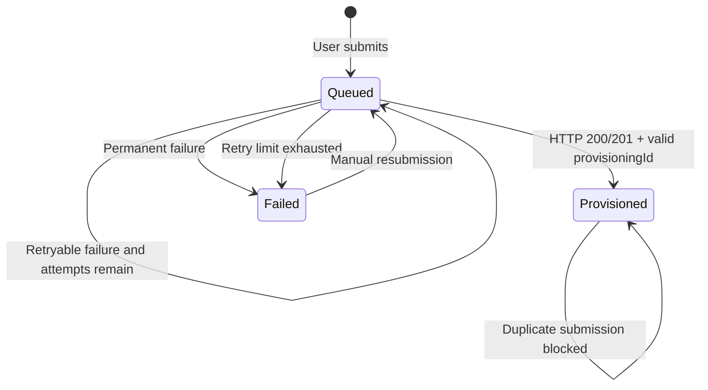

# Charger Provisioning Integration

This document describes the VoltEdge 360 outbound integration used to provision EV charging installations in an external charger platform after an `Installation_Project__c` is ready for operational handoff.

The implementation is intentionally designed as an enterprise-style integration rather than a synchronous UI call. It separates the user experience, orchestration, callout transport, retry policy, and audit state.

---

## Business Goal

Operations users need a controlled way to send an Installation Project from Salesforce to an external charger provisioning platform.

The integration must:

- be launched from the Installation Project record
- execute the external call asynchronously
- avoid duplicate provisioning of an already provisioned project
- store the external provisioning identifier in Salesforce
- expose HTTP and retry information for support and troubleshooting
- distinguish retryable transient failures from permanent failures
- retry transient failures automatically
- provide a manual retry path after the automatic retry limit is exhausted

---

## End-to-End Architecture



The UI transaction does not wait for the external system. The invocable action queues asynchronous work and immediately returns a submission status and Queueable Job Id to the Flow.

---

## Runtime Sequence

### Successful request



### Transient failure followed by retry



---

## Salesforce Components

| Component | Responsibility |
| --- | --- |
| `VE_Send_to_Provisioning` | Screen Flow used by the record action |
| `Installation_Project__c.Send_to_Provisioning` | Record Quick Action that launches the Flow |
| `VEChargerProvisioningAction` | Invocable Apex entry point; validates input, sets `Queued`, prevents re-submitting an already provisioned project, and enqueues asynchronous processing |
| `VEChargerProvisioningQueueable` | Executes the callout asynchronously, applies retry policy, and writes provisioning status/audit fields |
| `VEChargerProvisioningService` | Builds the HTTP request, sends the callout, parses the response, and classifies failures as retryable/non-retryable |
| `VE_Charger_Provisioning` | Named Credential used as the callout base endpoint |
| `VE_Charger_Provisioning_User` | Permission set granting the access needed to use the provisioning feature |
| `Installation_Project_Record_Page` | Lightning record page with provisioning information and Dynamic Action visibility |

---

## Installation Project Audit Fields

The integration persists its operational state on `Installation_Project__c`.

| Field | Purpose |
| --- | --- |
| `Provisioning_Status__c` | Current integration state: for example `Queued`, `Provisioned`, or `Failed` |
| `External_Provisioning_Id__c` | Identifier returned by the external provisioning platform |
| `Provisioning_HTTP_Status__c` | HTTP status returned by the most recent attempt |
| `Provisioning_Attempt_Count__c` | Number of the most recent automatic attempt |
| `Provisioning_Last_Attempt__c` | Timestamp of the most recent attempt |
| `Provisioning_Error__c` | Retry/failure detail for support and troubleshooting |

These fields are displayed in a dedicated **Provisioning** section on the Installation Project record page.

---

## User Experience

The record action is designed around the operational lifecycle rather than exposing Apex directly to users.

```text
Installation Project
      |
      +-- Send to Provisioning
              |
              v
        VE Send to Provisioning Flow
              |
              v
        Submit Charger Provisioning
              |
              v
        Queued / Already Provisioned
```

Dynamic Action visibility prevents unnecessary or duplicate submissions:

- blank / retryable business state -> action can be available
- `Queued` -> action hidden while processing is in progress
- `Provisioned` -> action hidden after successful provisioning
- `Failed` -> action available again so an operations user can manually retry after the external issue is resolved

The Apex layer also enforces idempotency, so UI visibility is not the only protection.

---

## API Contract

### Endpoint

```text
Named Credential: VE_Charger_Provisioning
Method:           POST
Path:             /v1/installations
Content-Type:     application/json
Accept:           application/json
Timeout:          20 seconds
```

The actual host is externalized through the Named Credential and is not hard-coded in Apex.

### Idempotency

Every request includes:

```text
Idempotency-Key: <Installation Project Salesforce Id>
```

This gives the receiving platform a stable business key with which it can reject or safely de-duplicate repeated submissions.

Salesforce also refuses to reprocess a project when both conditions are true:

```text
Provisioning Status = Provisioned
AND
External Provisioning Id is populated
```

### Request payload

The service serializes a request containing:

```json
{
  "salesforceProjectId": "a01...",
  "projectName": "IP-00001",
  "accountId": "001...",
  "accountName": "Example Customer",
  "opportunityId": "006...",
  "opportunityName": "EV Charging Deployment",
  "numberOfSites": 3,
  "numberOfChargers": 12,
  "solutionType": "Mixed",
  "targetGoLiveDate": "2026-10-08"
}
```

### Successful response

The integration accepts HTTP `200` or `201` as transport-level success, then validates the JSON body.

Example:

```json
{
  "provisioningId": "PRV-10482",
  "status": "ACCEPTED",
  "message": "Installation accepted for provisioning"
}
```

A successful HTTP response without `provisioningId` is treated as an application-level failure.

Malformed JSON is also treated as a failure rather than being silently accepted.

---

## Retry Policy

Automatic retry is intentionally limited to transient failures.

| Failure | Retry? | Result |
| --- | --- | --- |
| HTTP 200 / 201 with valid `provisioningId` | No | `Provisioned` |
| HTTP 400-class client error other than 429 | No | `Failed` |
| HTTP 429 | Yes | Retry |
| HTTP 500+ | Yes | Retry |
| `CalloutException` | Yes | Retry |
| Invalid success JSON | No | `Failed` |
| Success response missing `provisioningId` | No | `Failed` |

Maximum automatic attempts:

```text
3
```

A transient failure before the final attempt stores:

```text
Provisioning Status = Queued
Provisioning Error  = <reason> Retry scheduled (attempt N of 3).
```

The Queueable then chains another Queueable job.

After the final failed attempt:

```text
Provisioning Status = Failed
```

The user can then submit the record again after the external dependency has recovered.

---

## Status State Model



---

## Security and Access

The provisioning feature uses a dedicated permission set rather than relying on profile-level configuration.

The permission set must grant both:

1. object-level Read access to `Installation_Project__c`
2. field-level access to the provisioning audit fields

This distinction matters because field permissions alone are not sufficient when the user does not have object-level access.

Internal integration state updates use explicit system-mode DML/query behavior where appropriate so that platform automation can maintain governance fields consistently. The user-facing entry point remains a `with sharing` invocable class.

---

## Automated Tests

`VEChargerProvisioningTest` covers the integration contract and failure behavior with `HttpCalloutMock` implementations.

Current provisioning-specific scenarios include:

- HTTP 201 success stores `Provisioned`, external provisioning id, HTTP status, attempt count, and last-attempt timestamp
- HTTP 400 fails immediately without retry
- HTTP 503 is classified as retryable and schedules another attempt
- final transient failure at attempt 3 becomes `Failed`
- invalid JSON returned with a success HTTP status is rejected
- success response without `provisioningId` is rejected
- already-provisioned project is idempotent and is not processed again
- request payload contains the expected Salesforce/business contract
- `Idempotency-Key` is populated from the Installation Project Id
- missing project input is rejected
- invocable action queues a valid project
- invocable action handles missing input and already-provisioned records

---

## Live End-to-End Validation

The integration was also validated against a real external HTTPS mock endpoint rather than only with Apex callout mocks.

### Happy path

Observed sequence:

```text
Salesforce
  -> POST /v1/installations
  <- HTTP 201
```

Observed Salesforce result:

```text
Provisioning Status        = Provisioned
External Provisioning ID  = PRV-10482
HTTP Status                = 201
Attempt Count              = 1
Provisioning Error         = empty
```

### Retry path

A stateful mock endpoint was configured to return a transient error on the first request and success on the next request.

Observed sequence:

```text
Attempt 1 -> POST /v1/installations -> HTTP 500
Attempt 2 -> POST /v1/installations -> HTTP 201
```

Observed Salesforce result:

```text
Provisioning Status        = Provisioned
External Provisioning ID  = PRV-RETRY-10483
HTTP Status                = 201
Attempt Count              = 2
Provisioning Error         = empty
```

A separate test with a persistent transient failure confirmed that Salesforce performs no more than three automatic attempts.

---

## Operational Troubleshooting

When provisioning fails, start with the Installation Project fields rather than the Developer Console.

### `Provisioning Status = Failed`

Check:

```text
Provisioning HTTP Status
Provisioning Attempt Count
Provisioning Error
Provisioning Last Attempt
```

Typical interpretation:

```text
HTTP 400
-> request rejected by external API
-> fix data/contract issue before resubmitting

HTTP 429 / 5xx
-> transient external dependency problem
-> automatic retries are attempted first

Attempt Count = 3 + Failed
-> automatic retry budget exhausted
-> investigate dependency and use manual retry after recovery
```

### `Queued` for an unexpectedly long time

Check the latest `AsyncApexJob` for `VEChargerProvisioningQueueable` and verify Named Credential connectivity.

### Successful HTTP status but Salesforce marks failure

Verify that the response body is valid JSON and contains a non-empty `provisioningId`.

---

## Source Files

Core implementation:

```text
force-app/main/default/classes/VEChargerProvisioningAction.cls
force-app/main/default/classes/VEChargerProvisioningQueueable.cls
force-app/main/default/classes/VEChargerProvisioningService.cls
force-app/main/default/classes/VEChargerProvisioningTest.cls
```

User experience and metadata:

```text
force-app/main/default/flows/VE_Send_to_Provisioning.flow-meta.xml
force-app/main/default/quickActions/Installation_Project__c.Send_to_Provisioning.quickAction-meta.xml
force-app/main/default/flexipages/Installation_Project_Record_Page.flexipage-meta.xml
force-app/main/default/layouts/Installation_Project__c-Installation Project Layout.layout-meta.xml
force-app/main/default/permissionsets/VE_Charger_Provisioning_User.permissionset-meta.xml
force-app/main/default/namedCredentials/VE_Charger_Provisioning.namedCredential-meta.xml
```

---

## Design Rationale

Several implementation choices are deliberate:

**Queueable Apex instead of a synchronous Flow callout**

Provisioning is an external operational process. Asynchronous execution decouples the UI transaction from network latency and provides a natural place for retry behavior.

**Named Credential instead of a hard-coded URL**

Endpoint configuration and authentication belong outside application code and can differ by environment.

**Idempotency at both Salesforce and API layers**

The UI hides the action when the record is already provisioned, Apex independently blocks the duplicate, and the outgoing request carries a stable idempotency key.

**Retry only transient failures**

Repeating a bad request does not fix a contract or validation problem. `429`, `5xx`, and callout transport failures are treated as transient; malformed application responses and ordinary client errors are not.

**Operational audit fields on the business record**

Support and operations users should be able to understand the integration state without reading debug logs.

This combination keeps the integration observable, recoverable, testable, and safe to operate from the Salesforce UI.
