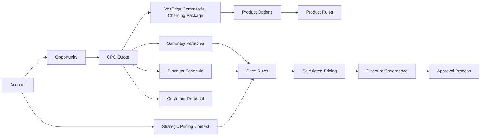

# Salesforce CPQ Implementation Case Study

## Overview

VoltEdge 360 includes a practical Salesforce CPQ implementation designed around a realistic EV charging sales scenario.

The goal is not only to demonstrate that a quote can be created, but to show how product configuration, pricing, discount governance, approvals, and quote generation can work together in an enterprise-style commercial process.

The CPQ implementation covers:

- product catalog and price books
- configurable bundles
- product options
- product rules and configuration dependencies
- summary variables
- discount schedules
- price rules
- account-driven strategic pricing
- pricing waterfall behavior
- quote generation
- discount governance and approval routing

---

# Business Scenario

VoltEdge sells commercial EV charging solutions that combine hardware, installation, software, and support.

A typical deal can include:

```text
Commercial Charging Package
├── Charging Hardware
├── Installation
├── Software
└── Support
```

The business needs CPQ to ensure that:

- only valid combinations can be configured
- installation requirements follow the selected charger configuration
- support tiers are compatible with the selected software tier
- volume pricing is applied consistently
- strategic customers can receive account-specific pricing treatment
- manual and automated discounts remain governed
- high discounts are routed for approval
- the final quote can be generated as a customer-facing proposal

---

# CPQ Solution Architecture



---

# Product Configuration

## VoltEdge Commercial Charging Package

The main commercial bundle is:

```text
VoltEdge Commercial Charging Package
```

It groups the products required to build a complete EV charging solution.

The bundle uses Product Options to represent the main commercial categories:

- charging hardware
- installation
- software
- support

The configuration is intentionally rule-driven rather than allowing every possible option combination.

---

# Product Rules

Product Rules enforce commercial and technical compatibility.

## High-Power Charger Installation Requirement

A 150 kW charger requires the appropriate premium installation option.

This prevents a sales user from configuring high-power charging hardware together with an installation package that is not suitable for that solution.

Conceptually:

```text
150 kW Charger selected
        ↓
Premium Installation required
```

## Enterprise Support Dependency

Enterprise / 24x7 support requires the compatible premium software configuration.

The rule prevents an invalid combination such as enterprise support together with an incompatible basic software option.

Conceptually:

```text
Enterprise Support selected
        ↓
Premium Software required
        ↓
Basic Software combination prevented
```

These rules demonstrate CPQ configuration governance rather than relying on sales users to remember product compatibility manually.

---

# Summary Variables

The implementation uses a CPQ Summary Variable to aggregate quote-line information for pricing logic.

The Summary Variable was configured to evaluate relevant product quantities using Product Code filtering.

A configuration issue was identified during implementation because the Summary Variable filter field must use the CPQ-visible field selection correctly. The working configuration uses:

```text
Product Code
```

rather than an invalid API-style field reference.

The Summary Variable is then available to pricing logic that needs quote-level information rather than only the values from one quote line.

This demonstrates both configuration and troubleshooting of CPQ calculation behavior.

---

# Discount Schedule

VoltEdge uses a quantity-based Discount Schedule:

```text
VE Charger Volume Discount
```

The purpose is to apply structured volume pricing when a customer purchases a larger number of charging units.

The implementation has been validated across quote-line quantities and multi-line scenarios so that pricing is based on the relevant aggregate quantity rather than on an isolated line only.

Business intent:

```text
Higher eligible charger quantity
        ↓
Applicable volume tier
        ↓
Automatic volume discount
```

This removes the need for sales users to calculate volume pricing manually.

---

# Account-Based Strategic Pricing

VoltEdge also supports pricing based on customer context.

A dedicated Account-level commercial attribute is used by a CPQ Price Rule to identify customers eligible for strategic pricing treatment.

Conceptually:

```text
Account commercial segment / strategic flag
        ↓
CPQ Price Rule evaluation
        ↓
Strategic pricing adjustment
```

This means pricing can depend not only on the selected products and quantities, but also on the customer being quoted.

The implementation also required handling Salesforce field types correctly inside CPQ rule conditions and formulas, including picklist/text behavior.

---

# Pricing Waterfall

VoltEdge has multiple pricing mechanisms that contribute to the final customer price.

From a business perspective, the implemented pricing flow is:

```text
Price Book / List Price
        ↓
Quantity-based Volume Pricing
        ↓
Account-based Strategic Pricing
        ↓
Additional / Manual Discount
        ↓
Final Net Price
```

Salesforce CPQ evaluates these pricing mechanisms according to the configured CPQ calculation sequence and rule evaluation order.

The important design principle is that the final price is explainable: the sales user and approver can identify which pricing mechanisms contributed to the quoted amount instead of treating the final Net Price as an unexplained manual override.

---

# Discount Governance

CPQ pricing is connected to VoltEdge's broader commercial governance model.

Quote Lines calculate an effective commercial discount against a frozen approval pricing basis.

Relevant fields include:

```text
Approval_Basis_Unit_Price__c
Effective_Discount__c
Discount_Reason__c
```

The governance model intentionally prevents a user from bypassing approval simply by reducing Unit Price while leaving the visible Discount field at zero.

Conceptually:

```text
Net Sales Price = Unit Price × (1 - Discount)

Effective Discount =
1 - Net Sales Price / Approval Basis Unit Price
```

The approval basis remains frozen so later Price Book changes do not rewrite the commercial context of an earlier approval decision.

---

# Approval Routing

The current commercial policy is:

| Effective Discount | Result |
| ---: | --- |
| 0% – 10% | No approval required |
| >10% – 20% | Sales Manager approval |
| >20% – 30% | Commercial Director approval |
| >30% | Blocked |

Exactly 30% is allowed; a value above 30% is rejected.

Approval routing is integrated with the Salesforce user hierarchy.

The implementation supports:

- submission for approval
- Sales Manager approval
- Commercial Director approval
- rejection
- recall
- resubmission
- missing approver handling
- inactive approver handling
- approval locking while a Quote is under review
- approval invalidation when commercially meaningful Quote Line data changes

---

# Commercial Revision Control

An approved Quote is not treated as permanently approved if its commercial terms change.

VoltEdge tracks:

```text
Commercial_Revision__c
```

Commercially meaningful changes such as Quantity, Unit Price, Discount, Discount Reason, Product, pricing basis, or Service Date invalidate the current approval state.

```text
Approved Quote
     ↓
Commercial change
     ↓
Approval invalidated
     ↓
Quote returns to Draft
     ↓
Commercial Revision incremented
     ↓
New approval required
```

This protects the integrity of the commercial approval process after CPQ pricing has been calculated.

---

# Quote Generation

VoltEdge includes a customer-facing CPQ quote template:

```text
VoltEdge Commercial Proposal
```

The proposal contains commercial information required to present the configured solution to the customer, including product-line pricing and proposal sections such as commercial terms and signatures.

The quote-generation work included troubleshooting template merge syntax, section configuration, and page flow so that the generated proposal reflects the final configured and governed pricing.

---

# End-to-End CPQ Scenario

A representative demonstration scenario is:

```text
1. Open a customer Account
2. Create / open an EV Charging Opportunity
3. Create a CPQ Quote
4. Add VoltEdge Commercial Charging Package
5. Select charger, installation, software, and support options
6. Product Rules validate configuration dependencies
7. Summary Variable evaluates eligible quote quantities
8. VE Charger Volume Discount applies volume pricing
9. Account context triggers strategic customer pricing when eligible
10. Additional discount is entered if required
11. CPQ calculates final pricing
12. Effective discount is evaluated for governance
13. Quote is routed to the correct approval level when required
14. Approved pricing is protected from silent commercial changes
15. VoltEdge Commercial Proposal is generated for the customer
```

---

# Validation Scenarios

The CPQ implementation has been manually validated against scenarios including:

| Scenario | Expected Result |
| --- | --- |
| Standard bundle configuration | Valid package can be configured |
| 150 kW charger without required installation | Configuration rule prevents invalid setup |
| Enterprise support with incompatible software | Product Rule prevents invalid combination |
| Eligible charger volume | Discount Schedule applies volume pricing |
| Quantity distributed across relevant lines | Aggregate pricing logic remains correct |
| Strategic customer | Account-driven Price Rule is applied |
| Non-strategic customer | Strategic pricing is not applied |
| Discount above approval threshold | Quote is routed to appropriate approver |
| Effective discount above 30% | Save is blocked |
| Commercial change after approval | Approval is invalidated and revision increments |
| Customer proposal generation | Quote template produces customer-facing output |

---

# Troubleshooting Experience

The implementation was deliberately tested beyond happy-path configuration.

Examples of issues diagnosed during the build include:

- Summary Variable filtering using the wrong field reference
- percentage values being represented incorrectly in rule configuration
- picklist/text handling in CPQ formulas and rule conditions
- product compatibility rules not firing because of configuration dependencies
- quote approval recalculation timing
- pricing and effective-discount behavior when Unit Price and Discount are both changed
- quote-template merge and page-flow configuration

These cases are important because CPQ consulting work frequently involves diagnosing calculation and configuration behavior rather than only creating new records.

---

# Consultant Perspective

This CPQ implementation can be described as a complete business requirement-to-solution story.

## Business Requirement

Sales needs a controlled way to configure EV charging packages, calculate scalable pricing, apply customer-specific commercial treatment, and obtain approval before customer-facing pricing is finalized.

## Functional Solution

Salesforce CPQ provides:

- configurable bundles
- Product Rules for compatibility
- Summary Variables for quote-level calculation context
- Discount Schedules for volume pricing
- Price Rules for account-driven pricing
- governed manual discounts
- approval routing
- quote generation

## Business Outcome

The solution reduces manual pricing decisions, prevents invalid product combinations, provides explainable pricing, and introduces a controlled approval process for commercial exceptions.

---

# Interview Talking Points

A concise explanation of the implementation is:

> I built a Salesforce CPQ scenario for an EV charging company. The solution uses a configurable bundle with Product Options and Product Rules, quantity-based Discount Schedules, a Summary Variable for quote-level pricing logic, and an Account-driven Price Rule for strategic customers. Those mechanisms form a pricing waterfall that ends in governed Net Price. I then connected CPQ pricing to discount approvals, approval locking, commercial revision control, and customer quote generation. During implementation I also troubleshot Summary Variable filtering, formula field-type behavior, pricing calculations, and quote-template configuration.

This story demonstrates both Salesforce administration and the consulting/debugging skills expected in a CPQ-focused role.

---

# Related VoltEdge Components

The CPQ solution integrates with the rest of VoltEdge 360, including:

- Sales Cloud Opportunity process
- Products and multi-currency Price Books
- revenue calculations (MRR, ARR, TCV, One-Time Revenue)
- Quote discount governance
- Salesforce Approval Process
- Opportunity Commercial Summary LWC
- Closed Won delivery automation
- Installation Project provisioning integration

For the broader project architecture, see the main [README](../README.md).
